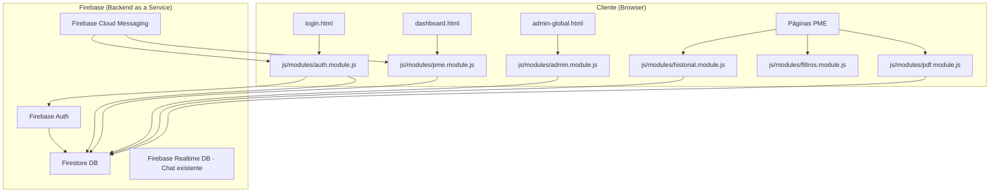
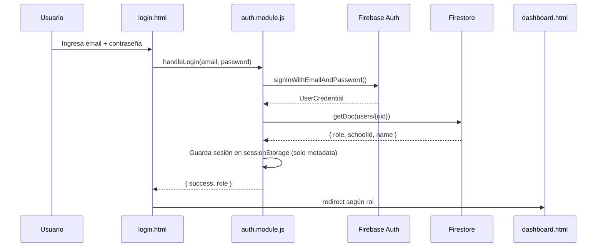
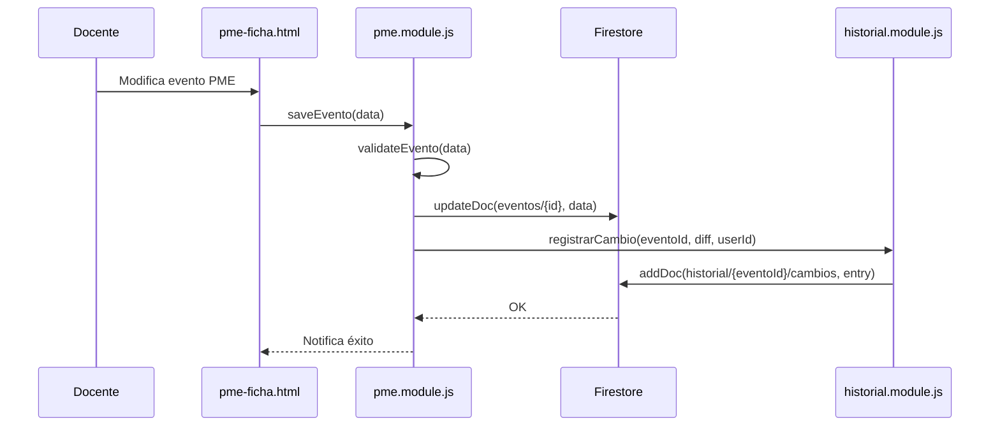

# Documento de Diseño: EDUGEST Mejoras v2

## Visión General

EDUGEST es un SaaS de gestión educativa para colegios chilenos que administra el Plan de Mejoramiento Educativo (PME). El sistema actual es frontend puro (HTML5/CSS3/JS vanilla) con localStorage como única persistencia y autenticación simulada en el cliente. Este plan de mejoras aborda cuatro ejes priorizados: (1) seguridad real con Firebase Auth, (2) persistencia centralizada con Firestore, (3) calidad de código con módulos ES6, y (4) nuevas funcionalidades (PDF, notificaciones push, historial de cambios, filtros avanzados).

El sistema atiende cuatro roles: `admin_global` (ve todos los colegios), `director` (gestiona su colegio), `docente` (registra eventos PME) y `tecnico` (soporte). La arquitectura resultante mantiene el stack frontend puro pero reemplaza la capa de datos falsa por Firebase como backend real.

---

## Arquitectura General



### Flujo de autenticación



### Flujo de escritura de evento PME con historial



---

## Estructura de Módulos ES6

El refactor reemplaza las ~40 variables globales `window.EdugestXxx` por módulos ES6 importados explícitamente. Cada página HTML carga un único script de entrada que importa solo lo que necesita.

```
js/
  modules/
    auth.module.js          ← Firebase Auth + sesión
    pme.module.js           ← CRUD eventos PME (Firestore)
    admin.module.js         ← Gestión colegios/usuarios (Firestore)
    historial.module.js     ← Registro de cambios por evento
    filtros.module.js       ← Filtros avanzados dashboard
    pdf.module.js           ← Exportación jsPDF
    fcm.module.js           ← Firebase Cloud Messaging
    roles.module.js         ← Permisos (refactor de roles-permissions.js)
    utils.module.js         ← Formateo, fechas, validación
  firebase-config.js        ← Configuración Firebase (sin cambios de interfaz)
```

Los archivos JS legacy (`login-modern.js`, `multi-school.js`, `admin-global.js`, etc.) se mantienen temporalmente para no romper páginas existentes, pero las páginas nuevas/refactorizadas usan solo los módulos.

---

## Modelo de Datos Firestore

### Colección `users`

```
users/{uid}
  email: string
  name: string
  role: "admin_global" | "director" | "docente" | "tecnico"
  schoolId: string | null        // null para admin_global
  active: boolean
  createdAt: Timestamp
  fcmToken: string | null        // para notificaciones push
```

### Colección `schools`

```
schools/{schoolId}
  name: string
  rbd: string
  address: string
  phone: string
  email: string
  location: string
  type: string                   // "Municipal" | "Particular" | etc.
  students: number
  budget: number
  active: boolean
  createdAt: Timestamp
```

### Colección `eventos`

```
eventos/{eventoId}
  schoolId: string               // aislamiento por colegio
  area: "Currículum" | "Liderazgo" | "Convivencia" | "Recursos"
  accion: number
  mes: string
  responsable: string            // uid del docente
  responsableNombre: string
  estado: "pendiente" | "en_progreso" | "completado" | "cancelado"
  meta: number
  n_eventos: number
  exito_objetivo: number
  descripcion: string
  fechaInicio: Timestamp
  fechaFin: Timestamp
  createdAt: Timestamp
  updatedAt: Timestamp
  createdBy: string              // uid
```

### Subcolección `eventos/{eventoId}/historial`

```
eventos/{eventoId}/historial/{cambioId}
  timestamp: Timestamp
  userId: string
  userName: string
  tipo: "creacion" | "edicion" | "cambio_estado" | "eliminacion"
  camposModificados: string[]    // ["estado", "meta"]
  valorAnterior: object          // snapshot parcial antes del cambio
  valorNuevo: object             // snapshot parcial después del cambio
```

### Colección `notificaciones`

```
notificaciones/{notifId}
  destinatario: string           // uid
  schoolId: string
  tipo: "evento_nuevo" | "cambio_estado" | "alerta_pme"
  titulo: string
  cuerpo: string
  leida: boolean
  createdAt: Timestamp
  eventoId: string | null
```

---

## Componentes e Interfaces

### Módulo `auth.module.js`

**Propósito**: Reemplaza completamente `login-modern.js`. Toda autenticación pasa por Firebase Auth. Elimina `DEMO_USERS`.

**Interfaz**:
```javascript
// Iniciar sesión con Firebase Auth
async function login(email, password)
// Returns: { uid, email, role, name, schoolId }
// Throws: AuthError con código Firebase

// Cerrar sesión
async function logout()

// Obtener usuario actual (desde sessionStorage + Firestore si expiró)
async function getCurrentUser()
// Returns: UserSession | null

// Escuchar cambios de estado de auth
function onAuthChange(callback)
// callback: (user: UserSession | null) => void

// Proteger página: redirige a login si no hay sesión
async function requireAuth(requiredRole = null)
// Returns: UserSession
// Throws: redirige si no autenticado o sin permiso
```

**Estructura de sesión** (sessionStorage, no localStorage):
```javascript
// sessionStorage key: "edugest_session"
{
  uid: string,
  email: string,
  role: string,
  name: string,
  schoolId: string | null,
  schoolName: string | null,
  tokenExpiry: number           // timestamp Unix
}
```

**Decisión de diseño**: Se usa `sessionStorage` en lugar de `localStorage` para la sesión. Firebase Auth maneja la persistencia real del token. El objeto en sessionStorage es solo caché de metadata para evitar un round-trip a Firestore en cada página.

---

### Módulo `pme.module.js`

**Propósito**: CRUD de eventos PME sobre Firestore, con aislamiento por `schoolId`.

**Interfaz**:
```javascript
// Crear evento
async function crearEvento(data)
// data: Omit<Evento, 'id' | 'createdAt' | 'updatedAt' | 'createdBy'>
// Returns: { id: string }

// Actualizar evento (registra historial automáticamente)
async function actualizarEvento(eventoId, cambios)
// cambios: Partial<Evento>
// Returns: void

// Obtener eventos del colegio actual con filtros opcionales
async function getEventos(filtros = {})
// filtros: { area?, responsable?, estado?, fechaDesde?, fechaHasta? }
// Returns: Evento[]

// Obtener un evento por ID
async function getEvento(eventoId)
// Returns: Evento | null

// Eliminar evento (soft delete: estado = "cancelado")
async function eliminarEvento(eventoId)
// Returns: void

// Suscripción en tiempo real a eventos del colegio
function suscribirEventos(filtros, callback)
// Returns: unsubscribe function
```

---

### Módulo `historial.module.js`

**Propósito**: Registrar y consultar el historial de cambios de cada evento PME.

**Interfaz**:
```javascript
// Registrar un cambio (llamado internamente por pme.module.js)
async function registrarCambio(eventoId, tipo, valorAnterior, valorNuevo)
// Returns: void

// Obtener historial de un evento
async function getHistorial(eventoId)
// Returns: CambioHistorial[]

// Obtener historial de un colegio (para admin/director)
async function getHistorialColegio(schoolId, limite = 50)
// Returns: CambioHistorial[]
```

**Algoritmo de diff** (para registrar solo campos modificados):
```pascal
PROCEDURE calcularDiff(anterior, nuevo)
  INPUT: anterior (object), nuevo (object)
  OUTPUT: { camposModificados, valorAnterior, valorNuevo }

  camposModificados ← []
  snapAnterior ← {}
  snapNuevo ← {}

  FOR cada campo IN UNION(keys(anterior), keys(nuevo)) DO
    IF anterior[campo] ≠ nuevo[campo] THEN
      camposModificados.push(campo)
      snapAnterior[campo] ← anterior[campo]
      snapNuevo[campo] ← nuevo[campo]
    END IF
  END FOR

  RETURN { camposModificados, valorAnterior: snapAnterior, valorNuevo: snapNuevo }
END PROCEDURE
```

---

### Módulo `filtros.module.js`

**Propósito**: Filtros avanzados del dashboard por área, responsable, estado y rango de fechas.

**Interfaz**:
```javascript
// Aplicar filtros a un array de eventos (filtrado local)
function aplicarFiltros(eventos, filtros)
// filtros: FiltrosConfig
// Returns: Evento[]

// Construir query Firestore con filtros (para carga inicial)
function construirQuery(baseRef, filtros)
// Returns: Firestore Query

// Serializar filtros a URL params (para compartir/bookmarking)
function filtrosToURL(filtros)
// Returns: string (query string)

// Deserializar filtros desde URL params
function filtrosFromURL(searchParams)
// Returns: FiltrosConfig
```

**Tipo FiltrosConfig**:
```javascript
{
  area: string | null,           // "Currículum" | "Liderazgo" | etc.
  responsable: string | null,    // uid del docente
  estado: string | null,         // "pendiente" | "en_progreso" | etc.
  fechaDesde: Date | null,
  fechaHasta: Date | null,
  texto: string | null           // búsqueda libre en descripción
}
```

---

### Módulo `pdf.module.js`

**Propósito**: Exportar informes PME a PDF usando jsPDF (cargado via CDN).

**Interfaz**:
```javascript
// Generar PDF de informe PME de un colegio
async function generarInformePME(schoolId, filtros = {})
// Returns: void (descarga automática)

// Generar PDF de ficha de un evento específico
async function generarFichaEvento(eventoId)
// Returns: void (descarga automática)
```

**Estructura del informe PDF**:
```pascal
PROCEDURE generarInformePME(schoolId, filtros)
  INPUT: schoolId (string), filtros (FiltrosConfig)
  OUTPUT: archivo PDF descargado

  SEQUENCE
    school ← await getSchool(schoolId)
    eventos ← await getEventos(filtros)
    stats ← calcularEstadisticas(eventos)

    doc ← new jsPDF()

    // Portada
    doc.addPage()
    renderPortada(doc, school, filtros)

    // Resumen ejecutivo
    doc.addPage()
    renderResumen(doc, stats)

    // Tabla de eventos
    doc.addPage()
    renderTablaEventos(doc, eventos)

    // Gráficos (canvas → imagen)
    FOR cada grafico IN graficosActivos DO
      canvas ← document.getElementById(grafico.id)
      imgData ← canvas.toDataURL('image/png')
      doc.addImage(imgData, 'PNG', ...)
    END FOR

    doc.save(`PME_${school.name}_${formatFecha(new Date())}.pdf`)
  END SEQUENCE
END PROCEDURE
```

---

### Módulo `fcm.module.js`

**Propósito**: Notificaciones push reales con Firebase Cloud Messaging.

**Interfaz**:
```javascript
// Solicitar permiso y registrar token FCM del usuario
async function registrarDispositivo()
// Returns: { token: string } | null (si usuario deniega permiso)

// Escuchar notificaciones en primer plano
function onNotificacionRecibida(callback)
// callback: (notificacion: Notificacion) => void

// Marcar notificación como leída
async function marcarLeida(notifId)
// Returns: void

// Obtener notificaciones no leídas del usuario actual
async function getNoLeidas()
// Returns: Notificacion[]
```

**Nota de implementación**: FCM requiere un Service Worker (`firebase-messaging-sw.js` en la raíz). Las notificaciones en segundo plano las maneja el SW. Las notificaciones en primer plano las maneja `onMessage()` de Firebase.

---

### Módulo `admin.module.js`

**Propósito**: Reemplaza los datos hardcodeados de `admin-global.js` y `multi-school.js` con lecturas/escrituras reales a Firestore.

**Interfaz**:
```javascript
// Obtener todos los colegios (solo admin_global)
async function getAllSchools()
// Returns: School[]

// Crear o actualizar colegio
async function saveSchool(data)
// Returns: { id: string }

// Obtener usuarios de un colegio
async function getUsersBySchool(schoolId)
// Returns: UserProfile[]

// Crear usuario (Firebase Auth + Firestore)
async function createUser(data)
// data: { email, password, name, role, schoolId }
// Returns: { uid: string }

// Activar/desactivar usuario
async function toggleUserStatus(uid, active)
// Returns: void
```

---

## Reglas de Seguridad Firestore

El aislamiento de datos por colegio se refuerza en las reglas de Firestore, no solo en el cliente:

```javascript
// firestore.rules (pseudocódigo de las reglas)
rules_version = '2';
service cloud.firestore {
  match /databases/{database}/documents {

    // Usuarios: solo el propio usuario o admin_global puede leer/escribir
    match /users/{uid} {
      allow read: if request.auth.uid == uid || isAdminGlobal();
      allow write: if isAdminGlobal();
    }

    // Colegios: lectura autenticada, escritura solo admin_global
    match /schools/{schoolId} {
      allow read: if request.auth != null;
      allow write: if isAdminGlobal();
    }

    // Eventos: aislados por schoolId del usuario
    match /eventos/{eventoId} {
      allow read: if belongsToSchool(resource.data.schoolId) || isAdminGlobal();
      allow create: if belongsToSchool(request.resource.data.schoolId)
                    && hasRole(['director', 'docente']);
      allow update: if belongsToSchool(resource.data.schoolId)
                    && hasRole(['director', 'docente']);
      allow delete: if isAdminGlobal() || hasRole(['director']);

      // Historial: solo lectura para miembros del colegio
      match /historial/{cambioId} {
        allow read: if belongsToSchool(get(/databases/$(database)/documents/eventos/$(eventoId)).data.schoolId);
        allow write: if false; // Solo escribe el backend (módulo server-side o regla especial)
      }
    }

    // Notificaciones: solo el destinatario puede leer/actualizar
    match /notificaciones/{notifId} {
      allow read, update: if request.auth.uid == resource.data.destinatario;
      allow create: if request.auth != null;
    }

    // Funciones auxiliares
    function isAdminGlobal() {
      return get(/databases/$(database)/documents/users/$(request.auth.uid)).data.role == 'admin_global';
    }
    function belongsToSchool(schoolId) {
      return get(/databases/$(database)/documents/users/$(request.auth.uid)).data.schoolId == schoolId;
    }
    function hasRole(roles) {
      return get(/databases/$(database)/documents/users/$(request.auth.uid)).data.role in roles;
    }
  }
}
```

---

## Especificaciones Formales de Funciones Clave

### `login(email, password)`

**Precondiciones:**
- `email` es string no vacío con formato válido de email
- `password` es string con longitud ≥ 6
- Firebase Auth está inicializado

**Postcondiciones:**
- Si credenciales válidas: retorna `UserSession` con `uid`, `role`, `schoolId` poblados desde Firestore
- Si credenciales inválidas: lanza `AuthError` con código `auth/wrong-password` o `auth/user-not-found`
- En ningún caso se almacena la contraseña en el cliente
- `sessionStorage["edugest_session"]` contiene la sesión serializada si el login fue exitoso

**Invariante de seguridad:** `DEMO_USERS` no existe en ningún módulo del sistema refactorizado.

---

### `actualizarEvento(eventoId, cambios)`

**Precondiciones:**
- `eventoId` corresponde a un documento existente en `eventos/`
- El usuario autenticado pertenece al mismo `schoolId` que el evento
- `cambios` es un objeto con al menos un campo válido de `Evento`

**Postcondiciones:**
- El documento en Firestore refleja los `cambios` aplicados
- Se crea un documento en `eventos/{eventoId}/historial/` con el diff calculado
- `updatedAt` del evento se actualiza al timestamp actual
- Si la operación falla, ni el evento ni el historial se modifican (transacción atómica)

**Invariante de aislamiento:** `evento.schoolId` nunca cambia durante una actualización.

---

### `aplicarFiltros(eventos, filtros)`

**Precondiciones:**
- `eventos` es un array (puede estar vacío)
- `filtros` es un objeto `FiltrosConfig` (campos opcionales pueden ser `null`)

**Postcondiciones:**
- Retorna subconjunto de `eventos` donde cada elemento satisface TODOS los filtros no-nulos
- Si todos los filtros son `null`, retorna `eventos` sin modificar
- No muta el array original

**Invariante de filtrado:**
```
∀ e ∈ resultado:
  (filtros.area == null ∨ e.area == filtros.area) ∧
  (filtros.estado == null ∨ e.estado == filtros.estado) ∧
  (filtros.responsable == null ∨ e.responsable == filtros.responsable) ∧
  (filtros.fechaDesde == null ∨ e.fechaInicio >= filtros.fechaDesde) ∧
  (filtros.fechaHasta == null ∨ e.fechaFin <= filtros.fechaHasta)
```

---

## Manejo de Errores

### Errores de autenticación

| Código Firebase | Mensaje al usuario |
|---|---|
| `auth/wrong-password` | "Contraseña incorrecta" |
| `auth/user-not-found` | "No existe una cuenta con ese correo" |
| `auth/too-many-requests` | "Demasiados intentos. Espera unos minutos" |
| `auth/network-request-failed` | "Sin conexión. Verifica tu internet" |

### Errores de Firestore

```pascal
PROCEDURE handleFirestoreError(error)
  INPUT: error (FirestoreError)

  IF error.code == "permission-denied" THEN
    mostrarError("No tienes permiso para esta acción")
    registrarEnConsola(error)
  ELSE IF error.code == "unavailable" THEN
    mostrarError("Servicio no disponible. Reintentando...")
    reintentarConBackoff()
  ELSE IF error.code == "not-found" THEN
    mostrarError("El recurso solicitado no existe")
  ELSE
    mostrarError("Error inesperado. Contacta soporte")
    registrarEnConsola(error)
  END IF
END PROCEDURE
```

---

## Estrategia de Migración

La migración de datos hardcodeados a Firestore se hace en dos fases para no romper el sistema en producción:

**Fase A — Paralelo (semanas 1-2):**
- Implementar módulos nuevos sin tocar archivos legacy
- Crear script de migración `scripts/migrate-to-firestore.js` que lee `DEMO_USERS` y `SCHOOLS_DATA` y los sube a Firestore
- Las páginas nuevas usan módulos; las páginas legacy siguen funcionando

**Fase B — Corte (semana 3):**
- Reemplazar `login.html` para usar `auth.module.js`
- Reemplazar `admin-global.html` para usar `admin.module.js`
- Eliminar `DEMO_USERS` de `login-modern.js` (o deprecar el archivo completo)

**Script de migración** (pseudocódigo):
```pascal
PROCEDURE migrarDatos()
  SEQUENCE
    // 1. Migrar colegios
    FOR cada school IN SCHOOLS_DATA DO
      await setDoc(doc(db, "schools", school.id), school)
    END FOR

    // 2. Migrar usuarios (crear en Auth + Firestore)
    FOR cada [email, userData] IN entries(DEMO_USERS) DO
      userCredential ← await createUserWithEmailAndPassword(auth, email, userData.password)
      await setDoc(doc(db, "users", userCredential.user.uid), {
        email: email,
        name: userData.name,
        role: userData.role,
        schoolId: userData.schoolId,
        active: true,
        createdAt: serverTimestamp()
      })
    END FOR

    console.log("Migración completada")
  END SEQUENCE
END PROCEDURE
```

---

## Estrategia de Testing

### Testing unitario

Cada módulo ES6 exporta funciones puras que se pueden testear con Vitest sin necesidad de Firebase real:

- `aplicarFiltros()` — testear con arrays de eventos mock
- `calcularDiff()` — testear con objetos antes/después
- `filtrosToURL()` / `filtrosFromURL()` — testear serialización/deserialización
- Validaciones de formularios — testear con inputs válidos e inválidos

### Testing basado en propiedades (fast-check)

**Librería**: fast-check

**Propiedades a verificar:**

1. **Idempotencia de filtros**: aplicar los mismos filtros dos veces produce el mismo resultado
   ```
   ∀ eventos, filtros: aplicarFiltros(aplicarFiltros(eventos, filtros), filtros) == aplicarFiltros(eventos, filtros)
   ```

2. **Monotonía de filtros**: agregar más filtros nunca aumenta el número de resultados
   ```
   ∀ eventos, f1, f2 donde f2 es más restrictivo que f1:
     |aplicarFiltros(eventos, f2)| ≤ |aplicarFiltros(eventos, f1)|
   ```

3. **Serialización de filtros**: serializar y deserializar produce el mismo objeto
   ```
   ∀ filtros: filtrosFromURL(filtrosToURL(filtros)) deepEquals filtros
   ```

4. **Diff reversible**: el diff captura exactamente los campos que cambiaron
   ```
   ∀ anterior, nuevo:
     camposModificados(anterior, nuevo) == { k | anterior[k] ≠ nuevo[k] }
   ```

### Testing de integración

- Usar Firebase Emulator Suite para tests de Firestore y Auth sin costos
- Verificar reglas de seguridad con `firebase emulators:exec`
- Testear flujo completo: login → cargar eventos → filtrar → exportar PDF

---

## Consideraciones de Seguridad

1. **Eliminar DEMO_USERS**: El objeto con contraseñas en texto plano en `login-modern.js` debe eliminarse en Fase B. Hasta entonces, el archivo no debe desplegarse en producción.

2. **Variables de entorno**: `firebase-config.js` actualmente tiene placeholders. Las credenciales reales deben cargarse desde `.env` (ya existe en el proyecto) usando un paso de build, o configurarse en el servidor de hosting (Firebase Hosting env vars).

3. **Sanitización de inputs**: Todos los campos de texto ingresados por el usuario deben sanitizarse antes de guardarse en Firestore. Usar `DOMPurify` (CDN) para campos que se renderizan como HTML.

4. **Validación de archivos**: Los uploads de documentos deben validar tipo MIME y tamaño máximo (10MB) antes de enviar a Firebase Storage.

5. **Rate limiting**: Firebase Auth ya incluye rate limiting nativo para intentos de login fallidos.

6. **Tokens FCM**: Los tokens FCM se almacenan en el documento del usuario en Firestore y deben rotarse cuando el usuario cierra sesión.

---

## Dependencias Externas

| Librería | Versión | Carga | Uso |
|---|---|---|---|
| Firebase SDK | 10.7.1 | CDN (ya existe) | Auth, Firestore, FCM, Realtime DB |
| jsPDF | 2.5.1 | CDN (nuevo) | Exportación PDF |
| DOMPurify | 3.x | CDN (nuevo) | Sanitización HTML |
| fast-check | 3.x | npm dev | Property-based testing |
| Vitest | 1.x | npm dev | Unit testing |

No se introduce ningún bundler en producción. Los módulos ES6 se cargan nativamente con `type="module"` en los scripts HTML.

---

## Consideraciones de Rendimiento

- **Paginación Firestore**: Las consultas de eventos deben usar `limit(50)` con cursor-based pagination para colegios con muchos eventos.
- **Índices compuestos**: Crear índices en Firestore para las combinaciones de filtros más comunes: `(schoolId, estado)`, `(schoolId, area, fechaInicio)`.
- **Caché local**: Usar `enableIndexedDbPersistence()` de Firestore para funcionamiento offline básico.
- **Lazy loading de jsPDF**: Cargar jsPDF solo cuando el usuario solicita exportar PDF, no en el carga inicial de la página.
